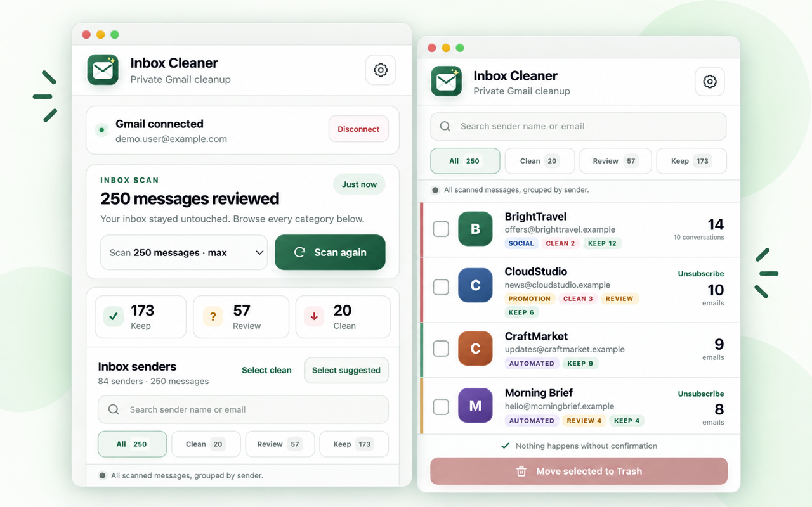

<p align="center">
  
</p>

<h1 align="center">Inbox Cleaner for Gmail</h1>

<p align="center">
  Review and clean low-value Gmail messages without giving up privacy.
</p>

<p align="center">
  <strong>Manifest V3</strong> · <strong>Local classification</strong> · <strong>No backend</strong> · <strong>No automatic deletion</strong>
</p>

<p align="center">
  Created and maintained by <strong>Hakan Akın</strong> · <a href="https://inbox.akins.app/">Website</a>
</p>

<p align="center">
  
</p>

Inbox Cleaner for Gmail is a Chrome extension for reviewing Gmail cleanup candidates. It connects through Google OAuth and calls the Gmail API directly from the extension. Classification is deterministic and runs locally; email data is never sent to an application server.

## What it does

- Connects each person to their own Gmail account with chrome.identity.
- Lets the user disconnect Gmail and clears account-specific local scan data during that action.
- Scans 50, 100, 200, or 250 inbox messages as metadata/snippets.
- Classifies locally with deterministic rules into KEEP, REVIEW, or CLEAN.
- Shows counts and a reviewable candidate list.
- Shows every scanned message, including KEEP, with All, Clean, Review, and Keep filters.
- Searches the sender list instantly by sender name or email address.
- Supports English, Spanish, Simplified Chinese, Hindi, Arabic, and Turkish with automatic browser-language detection and a manual language setting.
- Shows live scan progress while Gmail metadata is read with rate-limited concurrency.
- Reuses a 24-hour on-device message cache so repeat scans do not spend Gmail quota on unchanged messages.
- Restores the last completed scan, sender counts, and selections for 24 hours when the popup is reopened.
- Moves selected messages with one Gmail batch-label operation instead of one request per message.
- Groups repeated cleanup candidates by sender and can select up to 1,000 inbox messages from that exact sender with one action.
- Shows one sender row with a checkbox, sender identity, message count, and an Unsubscribe action when Gmail exposes a standard List-Unsubscribe link.
- Resolves exact inbox counts (up to 1,000 messages per sender) for the 30 most frequent cleanup senders.
- Displays Promotion, Social, Automated, REVIEW, and CLEAN badges on sender rows.
- Displays category counts per sender and explains what the active category means.
- Shows both individual email counts and Gmail conversation counts so Conversation view does not make successful Trash actions look incomplete.
- Requires explicit confirmation before moving selected messages to Trash.
- Stores preferences and the latest scan metadata locally on the device; it never uploads inbox data.

CLEAN is only a suggestion. Nothing is deleted automatically.

## How classification works

Each scanned message receives an explainable score from local signals such as promotion language, social notifications, automated sender patterns, and age. Trusted senders always remain in KEEP.

| Result | Meaning |
| --- | --- |
| KEEP | Low cleanup score or a trusted sender. |
| REVIEW | Some low-value signals were found; the user should decide. |
| CLEAN | Strong cleanup signals were found; the message is only suggested for selection. |

The extension never moves a message until the user selects it and confirms the Trash action.

## Google Cloud setup

1. Create or select a project in Google Cloud Console.
2. Enable Gmail API.
3. Configure the OAuth consent screen. Set the app name to `Inbox Cleaner for Gmail`. For a public extension, use a verified production app and expect Google’s verification process because gmail.modify is a sensitive/restricted Gmail scope.
4. For local development, create a Chrome Extension OAuth client using the unpacked extension ID shown at chrome://extensions. For public release, first create the Chrome Web Store draft and use its final extension ID for a separate production OAuth client. Do not use a web client ID.
5. Keep the committed `manifest.json` placeholder unchanged. Export your client ID locally and build an ignored unpacked directory:

   ```sh
   export GOOGLE_OAUTH_CLIENT_ID="your-client-id"
   ./scripts/build-unpacked.sh
   ```

6. Load `.build/unpacked` at `chrome://extensions` with Developer mode → Load unpacked.

To make the local unpacked ID match an existing Chrome Web Store item, also export the one-line public key shown under Store Dashboard → Package → View public key:

```sh
export EXTENSION_PUBLIC_KEY="your-one-line-public-key"
./scripts/build-unpacked.sh
```

The production OAuth client ID and Store public key are never stored in committed source files. They exist only in ignored local build output.

For local development, the OAuth consent screen may require adding test users. Test-user access can expire under Google’s testing rules; production distribution requires completing the consent/verification requirements for the scopes used.

## Permissions and privacy

- identity starts the user’s Google OAuth flow and receives a token for that user.
- storage saves local preferences and the latest completed scan on the device so closing the popup does not lose results.
- Gmail host access calls Gmail API endpoints from the extension.
- gmail.modify is needed because moving a message to Trash changes its Gmail state.

Message metadata and snippets are processed in the browser and are not sent to a server. OAuth tokens are managed by Chrome’s identity API; the extension does not write them to storage.

Chrome stable does not expose a production-ready account-list API to extensions; `chrome.identity.getAccounts()` is Dev channel only. Inbox Cleaner therefore supports one active Gmail account per Chrome profile, with an explicit Disconnect action. Separate Chrome profiles are the reliable option for simultaneous account use.

## Project layout

```text
manifest.json          Sanitized MV3 manifest template
popup.html/js          Popup controller and explicit Trash flow
options.html/js        Local rule preferences
src/gmail-client.js    Gmail API, OAuth token, quota, and cache handling
src/classifier.js      Deterministic category and scoring logic
src/rules.js           Explainable local classification signals
src/message-utils.js   Sender grouping, parsing, and counting helpers
src/sender-row.js      Sender row rendering and selection behavior
src/storage.js         Validated preferences and saved scan state
src/state.js           In-memory popup state
src/i18n.js            Locale detection, translation loading, and RTL support
test/                  Unit tests for pure application logic
assets/                Source logo and Chrome icon sizes
_locales/              Chrome and in-app translations for six languages
scripts/               Validation and credential-safe build scripts
site/                  Public homepage, privacy policy, terms, and support
```

## Development

The project has no runtime dependencies. Node.js 20 or newer is only required for local checks.

```sh
npm test
npm run check
```

`npm run check` validates JavaScript syntax and JSON files, then runs the unit test suite.

## Release checklist

- Publish the production website and legal pages from `site/` on an owned HTTPS custom domain.
- Confirm OAuth Branding displays Inbox Cleaner for Gmail and the public website URLs.
- Create the final Chrome Web Store draft first, then create a production Chrome Extension OAuth client for that exact Store extension ID.
- Export the production OAuth client ID locally; never commit it to the repository.
- Export the Store public key only when a local build must match the production extension ID.
- Test with a dedicated Gmail account and a small scan limit first.
- Review Google’s current OAuth verification and Chrome Web Store policies before publishing.
- Preserve the explicit-confirmation default in future versions.

Create a Store ZIP without modifying committed source:

```sh
export GOOGLE_OAUTH_CLIENT_ID="your-production-client-id"
export EXTENSION_PUBLIC_KEY="your-one-line-store-public-key" # optional for Store ZIP; useful for matching local builds
./scripts/build-release.sh
```

Generated ZIPs are ignored because they contain the injected OAuth client ID. See `PUBLISHING.md` for the complete release order and `release/` for ready-to-paste dashboard text and sanitized store assets.

## Repository safety

- `.wrangler/`, `.build/`, generated ZIPs, environment files, and signing material are ignored.
- CI rejects production-looking OAuth client IDs, the known Chrome public-key prefix, and Cloudflare account cache fields.
- Never commit real inbox data, OAuth tokens, or screenshots containing personal messages.

## License

Released under the [MIT License](LICENSE). Copyright © 2026 Hakan Akın.
